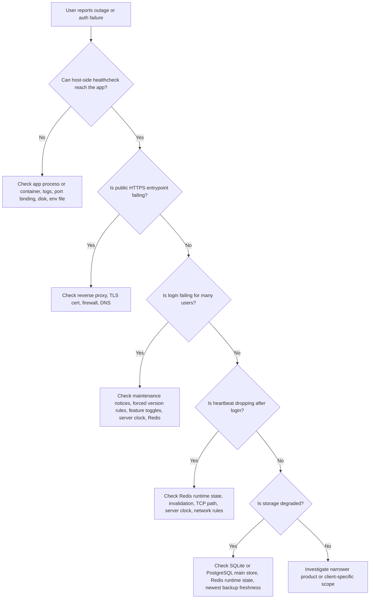

# Incident Response Playbook

Use this guide when the service is already in production and something is visibly wrong.

This document focuses on fast triage and safe recovery order for:

- admin or API outage
- login failures
- heartbeat instability
- PostgreSQL or Redis storage trouble
- TLS or reverse-proxy trouble
- signing-key and token verification incidents

Read this together with:

- [production-operations-runbook.md](/D:/code/OnlineVerification/docs/production-operations-runbook.md)
- [production-launch-checklist.md](/D:/code/OnlineVerification/docs/production-launch-checklist.md)
- [postgres-backup-restore.md](/D:/code/OnlineVerification/docs/postgres-backup-restore.md)
- [linux-deployment.md](/D:/code/OnlineVerification/docs/linux-deployment.md)
- [windows-deployment-guide.md](/D:/code/OnlineVerification/docs/windows-deployment-guide.md)

## First 3 minutes

1. Confirm whether the issue is local, regional, or global.
2. Write down the exact start time and what changed recently.
3. Do not restart every component at once.
4. Run the host-side healthcheck first.
5. Capture the newest app log lines before changing anything.
6. Confirm what storage topology is active right now.

Useful first commands:

Linux:

```bash
/opt/rocksolidlicense/deploy/linux/healthcheck-rocksolid.sh
tail -n 200 /var/log/rocksolid/rocksolid-server.log
```

Windows:

```powershell
powershell -ExecutionPolicy Bypass -File C:\RockSolidLicense\deploy\windows\healthcheck-rocksolid.ps1
Get-Content C:\RockSolidLicense\logs\rocksolid-server.log -Tail 200
```

Health values to confirm immediately:

- `GET /api/health`
- `ok=true`
- `data.status=ok`
- `data.storage.mainStore.driver`
- `data.storage.runtimeState.driver`

## Triage order



## Symptom matrix

- `Admin/API unreachable`
  Check app liveness first, then reverse proxy, then firewall and DNS.
- `Public site reachable but login fails`
  Check product feature toggles, maintenance notices, forced update rules, server clock, and Redis.
- `Login succeeds but heartbeat fails`
  Check Redis runtime state, runtime invalidation, TCP reachability, and clock skew.
- `Only one project fails`
  Check project status, feature toggles, version rules, notices, device blocks, and network rules.
- `Health says postgres or redis not ready`
  Check connection settings, container/service health, host reachability, disk, and latest backup freshness.
- `Token verification fails`
  Check signing key publication, `kid` mismatch, and whether a recent key rotation happened.
- `HTTPS broken`
  Check certificate expiry, proxy process status, and whether `3000` is still healthy locally.

## Admin or API unreachable

Check in this order:

1. Run the host-side healthcheck.
2. Confirm the app process or container is running.
3. Check the last `200` log lines.
4. Confirm the env file still exists and was not emptied or replaced.
5. Confirm the app can still bind to the intended ports.
6. If local health is good but public traffic fails, inspect proxy, firewall, and DNS.

Common causes:

- app process crashed on startup
- bad env value after a config change
- data volume or disk full
- reverse proxy stopped or certificate renewal broke
- port conflict on `3000` or `4000`

Safe recovery actions:

- restart only the failed layer you have identified
- if the app is healthy locally, restart the proxy before touching the app
- if the app fails immediately on startup, capture logs before retrying again

## Login failing for many users

Check in this order:

1. Verify `/api/health`.
2. Confirm the server clock is correct.
3. Check whether a maintenance notice is active.
4. Check whether a forced version rule is rejecting clients.
5. Check whether product-level feature toggles disabled register, account login, card login, or recharge.
6. If runtime state is Redis-backed, verify Redis connectivity.
7. Check whether request signature or timestamp validation failures are repeating in logs.

Things to separate quickly:

- `all products fail`
  Usually infrastructure, clock, proxy, or runtime-state trouble.
- `one product fails`
  Usually project status, feature toggles, notices, version rules, or product-specific policy.
- `old clients fail but new clients work`
  Usually version rules or public key cache problems.

## Heartbeat succeeds for some users but drops after login

Check in this order:

1. Confirm login and heartbeat requests are hitting the same intended environment.
2. Verify Redis health if `RSL_STATE_STORE_DRIVER=redis`.
3. Check whether runtime invalidation or single-session ownership is evicting sessions.
4. Check server clock drift again.
5. Check whether TCP clients can still reach `4000` if the SDK uses TCP.
6. Check whether network rules are blocking heartbeat while allowing login.

Likely causes:

- Redis unavailable or partially reachable
- old session owner invalidated the new one or vice versa
- client and server clocks drifted beyond the accepted skew
- load-balancer or firewall path differs between login and heartbeat

## One project or one customer segment fails

Check in this order:

1. Confirm the project is still `active`.
2. Check product feature toggles.
3. Check forced version rules and notices.
4. Check device blocks and network rules.
5. Check whether the policy allows the requested login style.
6. Check whether the affected users are direct card-login users or account users.

This matters because:

- `card login` issues can be tied to card state or direct-login policy
- `account login` issues can be tied to account status or entitlement state

## PostgreSQL main-store trouble

Use this section when:

- `RSL_MAIN_STORE_DRIVER=postgres`
- health shows PostgreSQL is not ready
- business data reads or writes start failing

Check in this order:

1. Confirm the PostgreSQL service or container is running.
2. Run `pg_isready` or an equivalent connectivity check.
3. Check host, port, user, password, and database settings.
4. Check data volume health and free disk space.
5. Check the newest `.dump` file timestamp.
6. Decide whether the issue is connectivity, capacity, or data corruption.

Safe recovery order:

1. Recover connectivity first if the database is healthy but unreachable.
2. If the database is corrupted or missing data, pause writes if possible.
3. Verify the newest valid dump before restoring.
4. Restore to a non-production target first when time allows.
5. Only then decide whether production needs a real restore.

Reference:

- [postgres-backup-restore.md](/D:/code/OnlineVerification/docs/postgres-backup-restore.md)

## Redis runtime-state trouble

Use this section when:

- `RSL_STATE_STORE_DRIVER=redis`
- health or logs suggest runtime-state problems
- logins, heartbeats, replay protection, or single-session ownership behave strangely

Check in this order:

1. Confirm Redis is reachable.
2. Check memory pressure and disk if AOF is enabled.
3. Check whether the app is using the Redis instance you expect.
4. Confirm the latest deploy did not change `RSL_REDIS_URL` or key prefix unexpectedly.
5. Verify whether the problem is loss of live runtime state only or wider auth failures.

Keep in mind:

- losing Redis runtime state is usually disruptive but recoverable
- users may need to log in again
- core business data should still come from SQLite or PostgreSQL main storage

## TLS or reverse-proxy trouble

Check in this order:

1. Confirm the app is healthy locally on `127.0.0.1:3000`.
2. Confirm the proxy process is running.
3. Check certificate expiry or renewal errors.
4. Check whether DNS still points to the correct host.
5. Check whether firewall or cloud security rules changed.

Fast separation:

- `local app healthy, public HTTPS broken`
  Usually proxy, certificate, firewall, or DNS.
- `local app unhealthy too`
  Usually app or storage before proxy.

## Signing-key or token verification incident

Use this section when:

- clients report token signature failure
- a new key rotation just happened
- an unknown `kid` appears
- private-key compromise is suspected

Check in this order:

1. Read `GET /api/system/token-key`.
2. Read `GET /api/system/token-keys`.
3. Confirm the active `kid` matches the signer you expected.
4. Check whether clients have stale cached public keys.
5. If compromise is suspected, preserve evidence before rotating again.

If compromise is likely:

1. Rotate signing keys.
2. Keep retired public keys published long enough for controlled transition unless compromise risk says otherwise.
3. Decide whether active sessions must be revoked.
4. Repackage or republish integration artifacts if software authors depend on pinned public keys.

## Safe recovery sequence

When a real outage needs intervention, use this order unless you already know the root cause:

1. Capture logs and current health state.
2. Confirm backup freshness.
3. Recover app liveness first.
4. Recover public HTTPS path second.
5. Recover login and heartbeat path third.
6. Restore from backup only after verifying that restart or connectivity fixes are not enough.
7. After recovery, re-run health, admin login, one client login, and one heartbeat.

## Recovery acceptance

Do not close the incident until all of the following are true:

- `/api/health` returns `ok=true`
- `data.status=ok`
- the intended main-store driver is reported
- the intended runtime-state driver is reported
- admin login works
- one real or test client can log in
- one heartbeat succeeds
- the newest backup artifacts are still being produced
- if PostgreSQL is enabled, the newest dump file is fresh enough
